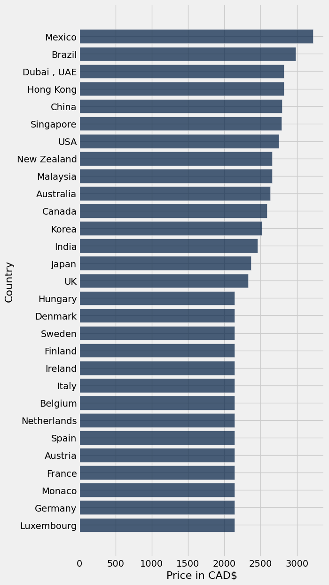
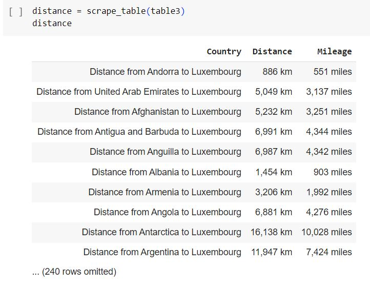
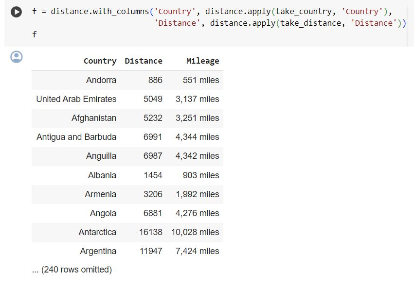
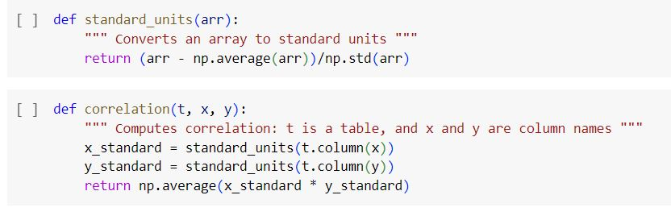
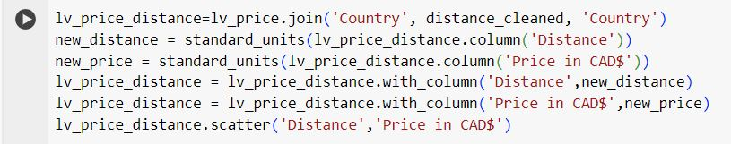
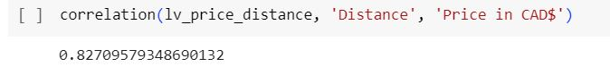

# Synopsis
The objective of this assignment is to look at the price difference of the LV Neverfull bag across different countries. We looked at how this price difference was affected by the importing distance of each country from the manufacturing location. Since the majority of the LV workshops for bag manufacturing are located in Europe, we chose Luxembourg as the origin location, from which these distances are measured, because Luxembourg is close to Central Europe.

# The Creation of the Index

## 1. Importing data on Price
Our first step was importing the table that included the price of the LV Neverfull bag in 29 different countries. The imported data did not require cleaning.

## 2. Converting the price to CAD
The 'Price in USD$' column included the price converted from its local currency to USD for each of the 29 countries. We then converted the price from USD to CAD using the exchange rate of 1.35. The 'Price in CAD$' column contains the newly converted currency data.

## 3. Making a Bar Graph
We then constructed a bar graph displaying the CAD price of the Neverfull bag in each of the 29 countries.

## 4. Importing data on Distance
We imported another table that shows the external factor that we assume contributes to the global price difference - Distance. The 'Distance' column of the graph displays each country's distance from Luxembourg, our origin location around which the bags are manufactured.

## 5. Cleaning data on Distance
We data-cleaned the 'distance' table into 'f' so we could join it with the price table and use the data to make a scatterplot. This way, we can analyze the correlation between the price difference of the LV Neverfull and the distance from the manufacturing/origin location.

## 6. Defining standard units and correlation functions and plotting
We figured the data would be better visualized if we converted it to standard units. Furthermore, we can use the data in standard units to calculate the correlation coefficient (r).

.png)

## 7. Calculating correlation and analyzing

We calculated the correlation between the distance from Luxembourg to each country and the prices of the bags and found that
a strong correlation exists (r > 0.5). Even though this correlation is not easily visible on the graph, our calculation can be
explained by the fact that most countries in Europe pay the same price for an LV Neverfull bag, whereas there is more fluctuation
in price differences among countries outside of Europe.

# Conclusion
The workshops for LV products are mainly located in Europe(Luxembourg). Therefore, these countries in Europe don't need to spend a substantial amount on import costs as the products are made in those countries. Another external factor that has likely thrown off our correlation coefficient for the two variables is import tax. Countries in Europe don't have to pay import tax as they are all in Europe. In contrast, countries outside of Europe, such as Mexico, have to pay a much larger amount for import tax, including the cost of importing the products over a larger distance. This, in part, can explain why the price of LV Neverfull is much more expensive in Mexico when compared to its cost in Luxembourg, which is the origin country of the bag.
