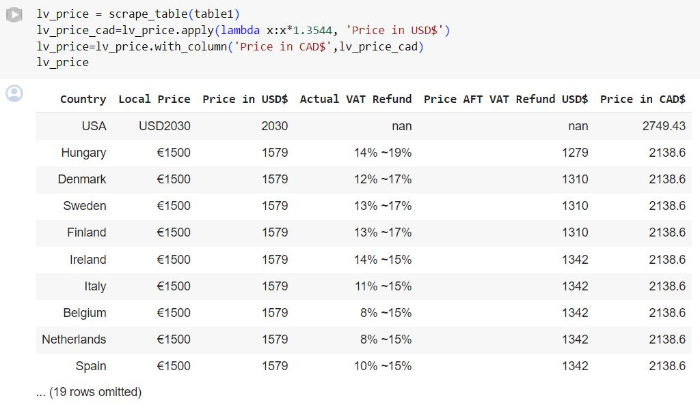

# Synopsis
The objective of this assignment is to look at the price difference of the LV Neverfull bag across different countries. We looked at how this price difference was affected by the importing distance of each country from the manufacturing location. Since the majority of the LV workshops for bag manufacturing are located in Europe, we chose Luxembourg as the origin location, from which these distances are measured, because Luxembourg is close to Central Europe'.

# The Creation of the Index
## 1. Importing data
We scraped the table 

